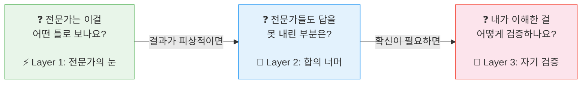
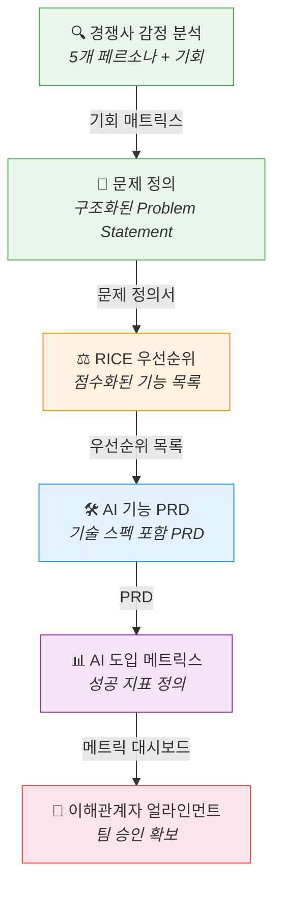
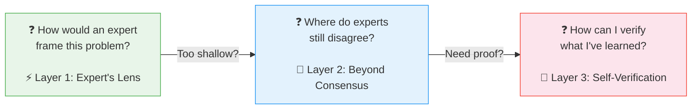

# 🧠 AI Prompts Playbook

<p align="center">
  
</p>

## AI에게 "답"을 구하지 마세요. "질문하는 법"을 바꾸세요.

2024년 Harvard AI 튜터 실험에서 흥미로운 결과가 나왔습니다.
같은 AI를 쓴 두 그룹 — 한 그룹은 답을 달라고 했고, 다른 그룹은 **구조적 질문**을 받았습니다.
결과: 구조적 질문을 받은 학생의 학습 성과가 **2배** 높았고, 답만 받은 학생의 추론 능력은 오히려 **하락**했습니다.

같은 AI. 다른 질문. 완전히 다른 결과.

이 플레이북은 **"AI에게 어떻게 질문할 것인가"**에 대한 33개의 답입니다.
PM이 매일 하는 일 — 경쟁사 분석, PRD 작성, 스프린트 기획, 임원 보고 — 을
**Chain of Thought(CoT) 기반의 구조적 질문**으로 풀어냅니다.

---

## 왜 "질문의 구조"가 중요한가?

```
❌ "경쟁사 분석해줘"
→ AI가 아는 것을 나열함 → 어디서든 볼 수 있는 결과

✅ "경쟁사 유저 5,000명의 리뷰를 5개 페르소나로 분류하고,
    각 페르소나의 JTBD와 감정 점수를 산출한 뒤,
    감정 점수가 가장 낮은 그룹에서 우리의 기회를 도출해줘"
→ AI가 단계별로 추론함 → 전략적 의사결정 근거가 나옴
```

차이는 "더 자세히 쓴 것"이 아닙니다.
**AI에게 추론의 순서(Chain of Thought)를 설계해준 것**입니다.

이 플레이북의 모든 프롬프트는 이 원리 위에 있습니다:
> **전문가의 사고 순서를 빌려서, AI에게 그 순서대로 생각하게 한다.**

---

## 세 개의 질문 — 이 플레이북의 설계 철학

모든 프롬프트는 세 가지 질문을 따릅니다:



| | Layer 1: 전문가의 눈 | Layer 2: 합의 너머 | Layer 3: 자기 검증 |
|--|--|--|--|
| **질문** | 전문가는 이 문제를 어떤 프레임으로 보나? | 전문가들 사이에서도 의견이 갈리는 지점은? | 내가 얻은 답을 어떻게 테스트하나? |
| **AI 활용** | 전문가의 프레이밍을 빌려서 질문 | CoT로 논쟁 지점을 탐구 | Python/SQL로 결과를 코드 검증 |
| **소요** | 5-10분 | 20-30분 | 30-60분 |
| **결과** | 구조화된 초안 | 전문가급 분석 | 자동화된 파이프라인 |

이것은 "초보 → 고급" 난이도가 아닙니다.
**"빌려서 생각하기 → 의심하기 → 검증하기"라는 인지의 깊이**입니다.

> 📖 더 깊이 읽기: [세 개의 질문 — AI 시대의 사고법](prompts/meta/three-questions.md)

---

## ⚡ 지금 바로 시작하기

아래를 복사해서 ChatGPT/Claude/Gemini에 붙여넣으세요:

```
당신은 10년 경력의 프로덕트 전략 컨설턴트입니다.

# 목표
{경쟁사명}의 사용자 감정을 분석하여 우리 제품의 기회를 발견합니다.

# 추론 전략
1. 먼저 {경쟁사명} 사용자들의 주요 불만/칭찬을 5개 페르소나로 분류하세요.
2. 각 페르소나별로: 목표, JTBD, 감정 점수(-1~1), 핵심 불만을 정리하세요.
3. 마지막으로, 감정 점수가 가장 낮은 페르소나의 불만에서 우리의 기회를 3개 도출하세요.

# 출력 형식
페르소나별 표 + 기회 매트릭스 (영향력 × 실현 가능성)
```

`{경쟁사명}`을 실제 경쟁사로 바꾸면 끝입니다.

**왜 이게 일반 프롬프트와 다른가요?**
- `역할 설정` → AI가 전문가의 프레이밍을 빌림
- `추론 전략 1→2→3` → AI가 단계별로 사고함 (CoT)
- `출력 형식 지정` → 결과가 바로 의사결정에 쓸 수 있는 형태

→ [이 프롬프트의 Layer 2, 3 보기](prompts/analyze/competitor-sentiment.md)

---

## 🔗 프롬프트는 혼자 쓰는 게 아니라 연결해서 쓴다

하나의 프롬프트로 끝나지 않습니다. **앞 프롬프트의 출력이 다음 프롬프트의 입력**이 됩니다.



각 프롬프트에 `📥 워크플로우 입력` 섹션이 있습니다.
"이전 프롬프트에서 뭘 가져와야 하는지"가 명시되어 있어서, 자연스럽게 체인이 만들어집니다.

---

## 🎯 나에게 맞는 프롬프트

### 지금 급한 일이 뭔가요?

**스프린트를 시작해야 한다**
→ [백로그 우선순위](prompts/decide/backlog-prioritization.md) → [스프린트 킥오프](prompts/decide/sprint-kickoff.md) → [유저 스토리](prompts/create/user-story.md)

**PRD를 써야 한다**
→ [JTBD 분석](prompts/analyze/jobs-to-be-done.md) → [페르소나 프로파일링](prompts/analyze/persona-profiling.md) → [요구사항 → PRD](prompts/create/requirements-to-prd.md)

**경쟁사가 움직였다**
→ [경쟁사 감정 분석](prompts/analyze/competitor-sentiment.md) → [포지셔닝 전략](prompts/decide/positioning-strategy.md) → [임원 브리핑](prompts/create/executive-briefing.md)

**임원에게 보고해야 한다**
→ [임원 브리핑](prompts/create/executive-briefing.md) → [이해관계자 얼라인먼트](prompts/communicate/stakeholder-alignment.md) → [스토리텔링](prompts/communicate/storytelling.md)

**AI 기능을 도입하려 한다**
→ [Build vs Buy](prompts/decide/build-vs-buy-ai.md) → [AI 기능 PRD](prompts/create/prd-for-ai-feature.md) → [AI 도입 메트릭스](prompts/measure/ai-adoption-metrics.md)

### 역할별 추천

| PM | CPO | 디자이너 | 엔지니어 |
|-----|------|---------|---------|
| [요구사항→PRD](prompts/create/requirements-to-prd.md) | [임원 브리핑](prompts/create/executive-briefing.md) | [페르소나](prompts/analyze/persona-profiling.md) | [AI 기능 PRD](prompts/create/prd-for-ai-feature.md) |
| [스프린트 킥오프](prompts/decide/sprint-kickoff.md) | [의사결정 캔버스](prompts/decide/decision-canvas.md) | [고객 여정](prompts/analyze/customer-journey-mapping.md) | [A/B 테스트](prompts/measure/ab-test-design.md) |
| [백로그 우선순위](prompts/decide/backlog-prioritization.md) | [포지셔닝 전략](prompts/decide/positioning-strategy.md) | [JTBD](prompts/analyze/jobs-to-be-done.md) | [리텐션 분석](prompts/measure/retention-analysis.md) |
| [유저 스토리](prompts/create/user-story.md) | [Build vs Buy](prompts/decide/build-vs-buy-ai.md) | [스토리 맵핑](prompts/create/user-story-mapping.md) | [AI 윤리 리뷰](prompts/communicate/ai-ethics-review.md) |

---

## 📦 전체 33개 프롬프트

<details>
<summary><b>🔍 analyze/ — 데이터 구조화 & 패턴 발견 (7개)</b></summary>

| 프롬프트 | 핵심 |
|---------|------|
| [경쟁사 감정 분석](prompts/analyze/competitor-sentiment.md) | 리뷰 데이터 → 5개 페르소나 + 감정 점수 + 기회 매트릭스 |
| [문제 정의](prompts/analyze/problem-framing.md) | 모호한 문제 → 구조화된 Problem Statement |
| [Jobs to Be Done](prompts/analyze/jobs-to-be-done.md) | 기능 중심 → Job 중심 사고 전환 |
| [페르소나 프로파일링](prompts/analyze/persona-profiling.md) | 데이터 기반 페르소나 생성 |
| [고객 여정 맵](prompts/analyze/customer-journey-mapping.md) | 접점별 감정 곡선 + 기회 포인트 |
| [PESTEL 분석](prompts/analyze/pestel-analysis.md) | 거시환경 → 제품 전략 영향도 |
| [기업 프로파일링](prompts/analyze/company-profiling.md) | DART + 잡플래닛 한국 기업 분석 |

</details>

<details>
<summary><b>⚖️ decide/ — 우선순위 & 전략 (6개)</b></summary>

| 프롬프트 | 핵심 |
|---------|------|
| [RICE 우선순위](prompts/decide/feature-prioritization.md) | 프레임워크 기반 기능 우선순위 |
| [포지셔닝 전략](prompts/decide/positioning-strategy.md) | April Dunford 프레임워크 |
| [의사결정 캔버스](prompts/decide/decision-canvas.md) | 합의제 의사결정 구조화 |
| [백로그 우선순위](prompts/decide/backlog-prioritization.md) | 규제/보안 포함 P0-P3 |
| [스프린트 킥오프](prompts/decide/sprint-kickoff.md) | 목표 + 용량 + 리스크 |
| [AI Build vs Buy](prompts/decide/build-vs-buy-ai.md) | AI 특화 의사결정 프레임 |

</details>

<details>
<summary><b>🛠️ create/ — 문서 & 산출물 (9개)</b></summary>

| 프롬프트 | 핵심 |
|---------|------|
| [AI 기능 PRD](prompts/create/prd-for-ai-feature.md) | 모델 스펙 + 실패 시나리오 |
| [유저 스토리](prompts/create/user-story.md) | INVEST + Bad vs Good 비교 |
| [유저 스토리 맵핑](prompts/create/user-story-mapping.md) | Activity → Task → Story |
| [유저 스토리 분할](prompts/create/user-story-splitting.md) | 스프린트 단위 분할 |
| [AI 강화 유저 스토리](prompts/create/user-story-ai-enhanced.md) | AI 특화 AC |
| [스펙 → PRD](prompts/create/spec-to-prd.md) | 기술 스펙 → 비즈니스 PRD |
| [요구사항 → PRD](prompts/create/requirements-to-prd.md) | PIPA/AI기본법 규제 포함 |
| [임원 브리핑](prompts/create/executive-briefing.md) | 두괄식 + 품의서 문화 |
| [제품 EOL 메시지](prompts/create/product-eol-message.md) | 서비스 종료 커뮤니케이션 |

</details>

<details>
<summary><b>📊 measure/ — 지표 & 실험 (3개)</b></summary>

| 프롬프트 | 핵심 |
|---------|------|
| [AI 도입 메트릭스](prompts/measure/ai-adoption-metrics.md) | 신뢰도를 핵심 지표로 |
| [A/B 테스트 설계](prompts/measure/ab-test-design.md) | AI 특화 샘플 크기 |
| [리텐션 분석](prompts/measure/retention-analysis.md) | 신뢰도-리텐션 인과관계 |

</details>

<details>
<summary><b>💬 communicate/ — 설득 & 정렬 (5개)</b></summary>

| 프롬프트 | 핵심 |
|---------|------|
| [이해관계자 얼라인먼트](prompts/communicate/stakeholder-alignment.md) | 이해관계자 맵 |
| [프레스 릴리즈](prompts/communicate/press-release.md) | Working Backwards |
| [스토리텔링](prompts/communicate/storytelling.md) | 데이터 + 내러티브 |
| [AI 윤리 리뷰](prompts/communicate/ai-ethics-review.md) | 편향성 통계 검증 |
| [크로스팀 핸드오프](prompts/communicate/cross-team-handoff.md) | 팀별 자동 인수인계 |

</details>

<details>
<summary><b>🧩 meta/ — 철학 & 도구</b></summary>

| 문서 | 역할 |
|------|------|
| [세 개의 질문](prompts/meta/three-questions.md) | 설계 철학 |
| [설계 원칙](prompts/meta/design-principles.md) | 7가지 원칙 |
| [사용법 가이드](prompts/meta/how-to-use.md) | 레이어별 실행법 |
| [프롬프트 빌더](prompts/meta/prompt-builder.md) | 나만의 프롬프트 |
| [프롬프트 해부학](prompts/meta/prompt-anatomy.md) | 역공학 가이드 |

</details>

---

## 🇰🇷 왜 한국 PM 전용인가

영어 프롬프트를 번역하면 한국에서 쓸 수 없습니다. 맥락이 다르기 때문입니다.

| 영역 | 글로벌 프롬프트 | 이 플레이북 |
|------|---------------|------------|
| 규제 | GDPR 중심 | PIPA, 전자문서법, AI 기본법, CSAP |
| 보고 | Executive summary | 두괄식 + 품의서 결재 라인 |
| 데이터 | SEC Filing | DART 전자공시 + 잡플래닛 |
| 지표 | Global SaaS 벤치마크 | 카카오톡 알림 영향도, 한국 구독 피로도 |
| 문화 | Top-down 의사결정 | 합의제 + 린품의 |
| 근무 | Flexible hours | 주 52시간제 + 공휴일 캘린더 |

---

## 🤝 기여하기

새 프롬프트 추가, 한국 데이터 보강, 실전 사례 공유 모두 환영합니다.
→ [CONTRIBUTING.md](prompts/CONTRIBUTING.md)

---

## 🌐 English

### AI Prompts Playbook — Don't Ask AI for Answers. Redesign Your Questions.

A Harvard AI tutor study (2024) found that students who received **structured questions** achieved 2x higher learning outcomes than those who simply received answers — using the exact same AI. The difference wasn't the AI. It was the structure of the question.

This playbook applies that principle to Product Management. **33 prompts** built on Chain of Thought reasoning, where every prompt designs a step-by-step thinking sequence for AI — not just a request for information.



These aren't difficulty levels. They're **depths of cognition** — borrow expert thinking → challenge consensus → verify with code.

**What makes this different:**
- Every prompt embeds **Chain of Thought** — AI reasons step-by-step through expert frameworks, not just retrieves information
- Prompts **chain together** — output of one becomes input of the next, creating end-to-end PM workflows
- **Korean market data** built in — local regulations (PIPA, AI Act), business culture (consensus decision-making, 품의서), and data sources (DART, JobPlanet)
- **Educational annotations** (`[Expert's Lens]`, `[Debate Point]`, `[Self-Check]`) explain *why*, not just *what*

→ [How to Use](prompts/meta/how-to-use.md) · [Three Questions Philosophy](prompts/meta/three-questions.md) · [Contributing](prompts/CONTRIBUTING.md)

---

**License**: MIT · **Version**: 2.1 (2026-03-12) · **Author**: Ethan Kim
